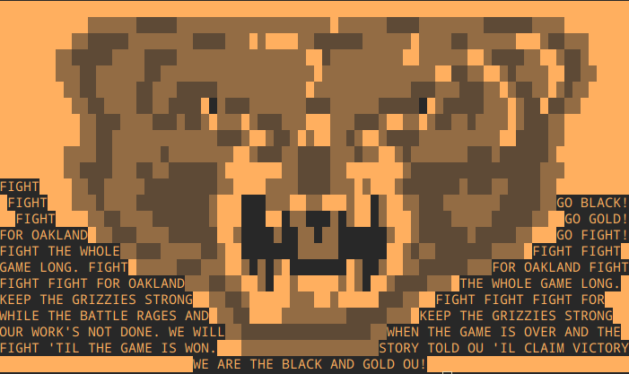

# Grizzly-Quines
## Inspiration

I'm proud to say that GrizzHacks 5 is my first GrizzHacks hackathon. It is such a pleasure to experience the thrill and excitement as did my other friends who have experienced previous GrizzHacks hackathons. In commemoration, my teammate and I decided to build one of our favorite quirks in programming: quines that are shaped into something.

## What it does

Basically, a quine is a "self replicating" program that takes in no input, and outputs itself. Here, I took the GrizzHacks bear mascot and converted it into ascii and put it inside the quine and made it print itself in the terminal. You can see all the code and the final image in the terminal just by running the python program. It's that simple.

## How I built it

A quine is classified as a program that takes no input and outputs a quine. However, a quine should not use any 'open()' function to print out its source code, rather it must print out its own code via print statements or otherwise. Using an 'open()' function would be considered cheating, in a sense. What I did was took the ascii image of the GrizzHacks mascot and put inside a string. Then, I tried to work out the character escapes and notation inside the string to be printed, so that it can print itself. This is perhaps one of the easiest ways to create a quine: to define a string, then put the string inside itself with string formatting. Unobfuscated, you can clearly see the GrizzHacks bear mascot _as well as_ the code used to make it. Of which, include the character escapes, the string that is printed, and the variable storing that string.

